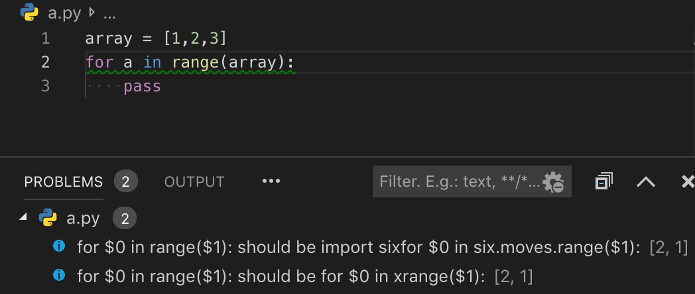

# DevReplay for Visual Studio Code

A Visual Studio Code extension with that will suggest source code fix based on your own rule file.
* Command Line version is [here](https://www.npmjs.com/package/devreplay)
* GitHub bot version is [here](https://github.com/marketplace/dev-replay)


## Quick start

0. Install this extension!
1. Create your own programming style(`./devreplay.json`) on the root like bellow 

(**Recommend**) [Review Pattern Generator](https://github.com/Ikuyadeu/review_pattern_gen) can generate your rule file automatically
```json
[
  {
      "condition": [
          "for $0 in range($1):"
      ],
      "consequent": [
          "import six",
          "for $0 in six.moves.range($1):"
      ],
      "severity": "W"
  },
  {
      "condition": ["hello $1"],
      "consequent": ["Hello $1!!!"],
      "severity": "I"
  }
]
```
This mean if your code has `range`, it should be `six.moves.range` or `xrange` for the python2



And create your code like this.
```python
for a in xrange(array.x):
    pass
```

2. Edit a your vscode settings' `devreplay.ruleFile` to `devreplay.json`
3. Save your file or `F1` + `Fix by DevReplay`

It will be change
```python
import six
for a in six.moves.range(array.x):
    pass
```

## Extension Settings

This extension contributes the following settings:

* `devreplay.ruleFile`: The absolute path to the devreplay rules file
* `devreplay.replayOnSave`: Whether to check files when saved

## Supported Language

* CPP
* Java
* JavsScript
* Python
* Ruby
* TypeScript
* Plain Text


## Thanks

This package is made based on
* [vscode-tslint](https://github.com/microsoft/vscode-tslint)
* [vscode-eslint](https://github.com/microsoft/vscode-eslint)

We would like to thank the Support Center for Advanced Telecommunications (SCAT) Technology Research, Foundation.
This system was supported by JSPS KAKENHI Grant Numbers JP18H03222, JP17H00731, JP15H02683, and JP18KT0013.
