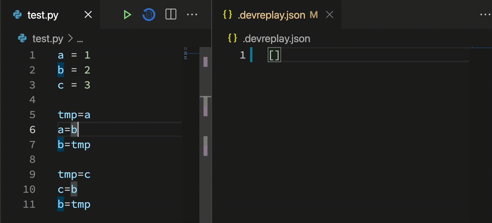
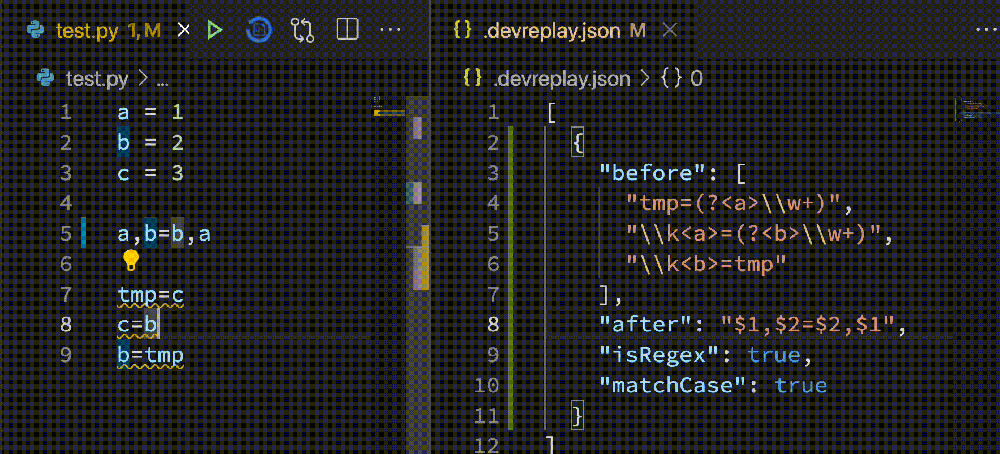

# DevReplay for Visual Studio Code

Suggest source code fix based on your regular expressions.



## Quick start

0. Install this extension!
1. Create your own programming pattern(`.devreplay.json`) on the root like bellow

```json
[
  {
    "before": [
      "(?<tmp>.+)\\s*=\\s*(?<a>.+)",
      "\\k<a>\\s*=\\s*(?<b>.+)",
      "\\k<b>\\s*=\\s*\\k<tmp>"
    ],
    "after": [
      "$2, $3 = $3, $2"
    ],
    "isRegex": true
  }
]
```

or You can chose the your programming language and framework.

```json
[
    "python"
]
```

Following languages and Frameworks are supported.

| Languages  | Frameworks      |
|------------|-----------------|
| C          | Android         |
| CPP        | Angular         |
| Cobol      | chainer2pytouch |
| Dart       | Rails           |
| Java       | React           |
| JavaScript | TensorFlow      |
| PHP        |                 |
| Python     |                 |
| Ruby       |                 |
| TypeScript |                 |
| VS Code    |                 |
| Vue        |                 |

If you write the following code,

```python
tmp = a
a = b
b = tmp
```

it will be

```python
a, b = b, a
```

the problem display can be custimized by editing `severity` like following.


```json
[
  {
    "before": [
      "(?<tmp>.+)\\s*=\\s*(?<a>.+)",
      "\\k<a>\\s*=\\s*(?<b>.+)",
      "\\k<b>\\s*=\\s*\\k<tmp>"
    ],
    "after": [
      "$2, $3 = $3, $2"
    ],
    "isRegex": true,
    "severity": "error",
    "author": "Yuki",
    "message": "Value exchanging can be one line"
  },
]
```

## Other Implementation

* [Language Server](https://www.npmjs.com/package/devreplay-server)
* [NPM package](https://www.npmjs.com/package/devreplay)
* [GitHub Application](https://github.com/marketplace/dev-replay)

## Contributing

Please check [CONTRIBUTING.md](https://github.com/devreplay/vscode-devreplay/blob/master/CONTRIBUTING.md)

## Acknowledgements

DevReplay is supported by 2019 Exploratory IT Human Resources Project [The MITOU Program](https://www.ipa.go.jp/jinzai/mitou/portal_index.html).
